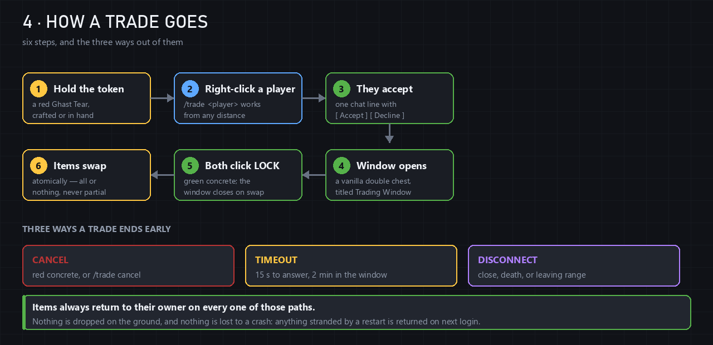
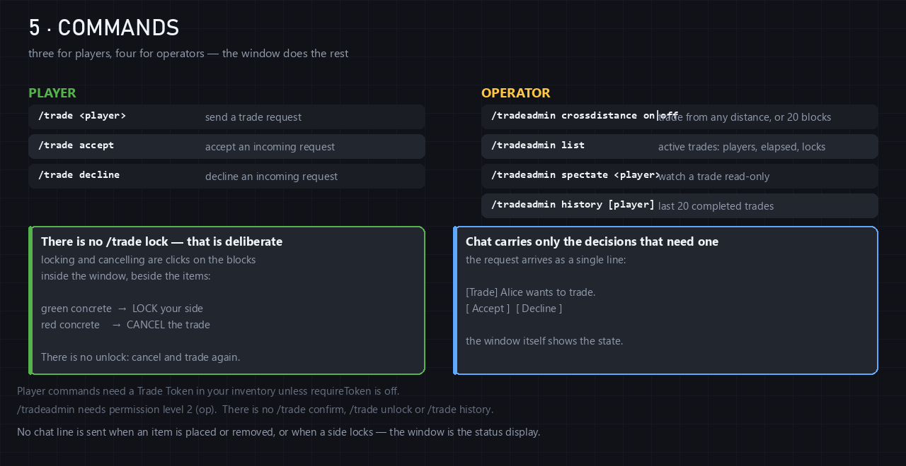
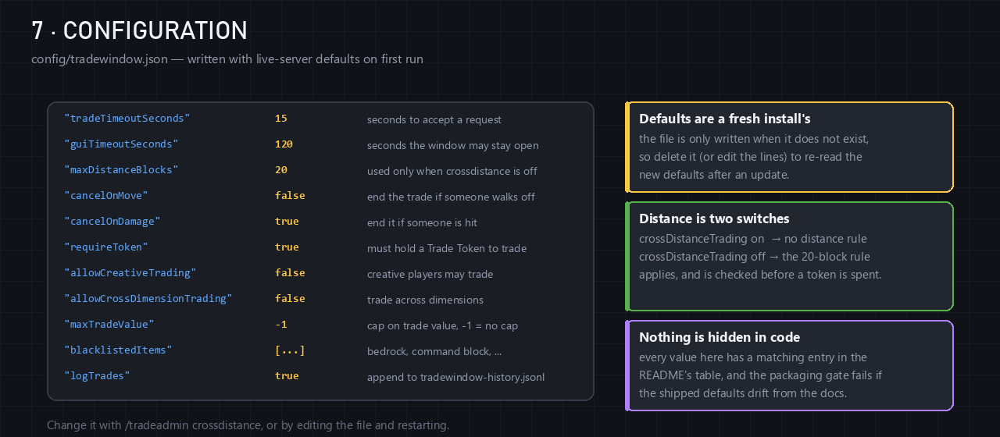
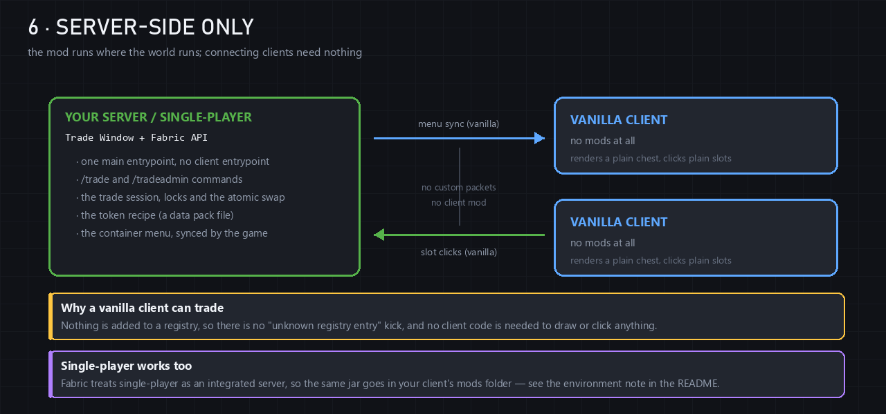

<div align="center">


# 🪟 Trade Window

**A real trading window for Minecraft servers — with nothing installed on your players' clients.**


</div>

Two players open one window, each drops in what they are offering, each locks their
side, and the items swap — **atomically, all or nothing**. It looks and behaves like
the trade screen you would expect from a big server, and the people using it need to
install **absolutely nothing**.

<div align="center">

### 🎬 The 30-second version



</div>

---

## ✨ Why this one is different

| | |
|---|---|
| 🖥️ **Server-side only** | Install it where the world runs. Connecting players need **no mods at all** — not even a resource pack. |
| 🧩 **Registers nothing** | No custom item, no custom block, no custom entity, no packet. Zero entries added to any registry, so the `unknown registry entry` client kick is impossible. |
| 🧾 **A vanilla token** | The Trade Token is an ordinary **Ghast Tear** with a name, made by a normal crafting recipe. A datapack trick, not a registration. |
| 📦 **A vanilla window** | The trade screen is a plain **double chest** (`GENERIC_9x6`) with items in it. No custom GUI code can desync, because there is no custom GUI code. |
| 🎛️ **Buttons you can click** | Green **LOCK** and red **CANCEL** blocks sit inside the window, next to your items. Losing the trade menu cannot cost you your items. |
| 🔁 **Mirrored per player** | Each player always sees **their own offer** in the middle rows and their partner's below. Nobody has to work out whose half is whose. |
| 🛡️ **Built for live servers** | Disconnect, death, distance, damage, timeout, full inventories, blacklists, value caps, atomic swaps and crash recovery are all handled. |
| 🌍 **14 versions from one design** | 1.21.1 through 26.3, generated from a single reference tree, with the build asserting the differences. |

---

## 📖 Contents

- [🪙 Crafting the Trade Token](#-crafting-the-trade-token)
- [🪟 Inside the trading window](#-inside-the-trading-window)
- [💬 Commands](#-commands)
- [🛠️ Operator tools](#-operator-tools)
- [⚙️ Configuration](#-configuration)
- [🔒 Server-side only, explained](#-server-side-only-explained)
- [📦 Install](#-install)
- [🧱 Building from source](#-building-from-source)
- [🗺️ Roadmap](#-roadmap)
- [⚠️ Limitations](#-limitations)
- [📚 Documentation](#-documentation)

---

## 🪙 Crafting the Trade Token

<div align="center">


</div>

The token is a **vanilla Ghast Tear** carrying three data components — `custom_name`,
`lore` and `max_stack_size` — produced by an ordinary shapeless recipe. No item is
registered anywhere; the craft is resolved entirely by a data pack file inside the jar.

```
1 × minecraft:ghast_tear
1 × minecraft:gold_ingot          →   1 × ghast_tear named "Trade Token" (red)
   (shapeless, any two slots)           stacks to 16, with gray italic lore
```

> **Why a renamed tear instead of a proper item?** A registered item has to be known by
> every client that connects; a client that has never heard of it is kicked with
> *“Received a registry entry that is unknown to this client.”* A Ghast Tear named
> `Trade Token` needs no client at all — and the server's registries stay byte-for-byte
> identical to vanilla's, which is what makes this mod safe to add to a running server.

The mod recognises a token by checking the held stack is a **Ghast Tear** *and* it
carries the name `Trade Token` *and* the `max_stack_size` of 16. A plain tear fails, and
so does an anvil-renamed one — the components are the identity.

A [data component encoding note](#-data-component-encoding-a-footgun) at the bottom
explains the one piece of this that surprised us, in case you fork it.

---

## 🪟 Inside the trading window

<div align="center">


</div>

A plain double chest, titled **Trading Window**:

| Row | Slots | What it is |
|---|---|---|
| 1 | `0–8` | **Your header** — spacers, 🟩 **LOCK**, your head, 🟥 **CANCEL**, spacers |
| 2–3 | `9–26` | **Your offer** — your items go here |
| 4 | `27–35` | **Their header** — the same blocks, for their side |
| 5–6 | `36–53` | **Their offer** — their items, locked to them |

- **Your half is always above theirs.** Each player gets their own menu instance over
  the same shared items, so the window mirrors itself and nobody has to be told which
  side is which.
- 🟩 **Click the green block** to lock your side. It turns into a green pane reading
  `LOCKED`, and both players see it.
- 🟥 **Click either red block** to cancel and get everything back.
- **When both sides are locked**, the items swap and the window closes.
- **Closing the window ends the trade** and returns every item — exactly like Cancel.
  Escaping out can never cost you anything.

Cardinal rule: **only your own offer rows accept items**, enforced on the server for
every single click. Either player can lock or cancel (a griefer cannot stall you, and
you can always get your own items back), but nobody can touch the other side's items.

---

## 💬 Commands

<div align="center">



</div>

### Player — permission level 0

| Command | What it does |
|---|---|
| `/trade <player>` | Sends a trade request. Needs a Trade Token unless `requireToken` is off. |
| `/trade accept` | Accepts the request currently shown to you. |
| `/trade decline` | Declines it. |

That is the whole player command set, on purpose. The request arrives in chat as one
line with two clickable buttons, and everything afterwards is a **click in the window**:

```
[Trade] Alice wants to trade.
[ Accept ]  [ Decline ]
```

There is deliberately **no `/trade lock`, `/trade unlock`, `/trade cancel` or
`/trade confirm`** — six ways to say two things is how trading mods get confusing.
Locking is the green block, cancelling is the red block, and there is no unlock at all:
if you change your mind, cancel and start again, which is exactly the rule that stops a
half-changed offer from ever being swapped.

**Chat stays quiet.** No line is sent when an item is placed or removed, when a side
locks, or on a countdown. The window shows the state; chat carries only events.

---

## 🛠️ Operator tools

Permission level 2 (`op`):

| Command | What it does |
|---|---|
| `/tradeadmin crossdistance <on\|off>` | `off` restores the `maxDistanceBlocks` rule. Saved to the config file immediately. |
| `/tradeadmin list` | Every live trade: both names, elapsed time, both lock states. |
| `/tradeadmin spectate <player>` | Opens that player's trade **read-only**. State, timer and locks are untouched, and the admin does not appear as a participant. |
| `/tradeadmin history [player]` | The last 20 completed trades, newest first, with an abbreviated list of what moved. |

`spectate` closes like any container and leaves no trace on the trade.

---

## ⚙️ Configuration

<div align="center">



</div>

`config/tradewindow.json`, written with live-server defaults on first run. Every field
is optional — a missing field keeps its default, so deleting a line is safe.

```json
{
  "tradeTimeoutSeconds": 15,
  "guiTimeoutSeconds": 120,
  "maxDistanceBlocks": 20,
  "crossDistanceTrading": true,
  "cancelOnDamage": true,
  "cancelOnMove": false,
  "requireToken": true,
  "logTrades": true,
  "useDatabase": false,
  "allowCreativeTrading": false,
  "allowCrossDimensionTrading": false,
  "blacklistedItems": ["minecraft:bedrock", "minecraft:command_block"],
  "maxTradeValue": -1
}
```

| Key | Default | What it means |
|---|---|---|
| `tradeTimeoutSeconds` | `15` | How long a **request** stays pending. Short on purpose: it also bounds how long the requester's token is reserved. |
| `guiTimeoutSeconds` | `120` | How long the **window** may stay open. An idle safeguard, not a countdown to race. |
| `maxDistanceBlocks` | `20` | How far apart traders may drift. Only read when the distance rule runs at all. |
| `crossDistanceTrading` | `true` | When on, the distance rule does not run and trades work at any distance. |
| `cancelOnDamage` | `true` | End the trade when either player takes damage. |
| `cancelOnMove` | `false` | Master switch for the distance rule. **Both** switches must be on for it to run. |
| `requireToken` | `true` | Require a Trade Token to send a request, and spend it on open. |
| `logTrades` | `true` | One line per finished trade in `tradewindow.log`. |
| `useDatabase` | `false` | Also store history in SQLite (see below). |
| `allowCreativeTrading` | `false` | Let creative and survival players trade. |
| `allowCrossDimensionTrading` | `false` | Let players in different dimensions trade. |
| `blacklistedItems` | bedrock, command block | Item ids that can never enter a window. |
| `maxTradeValue` | `-1` | Cap on the combined offer value. `-1` disables it. |

Values outside a sane range are **clamped toward safety** on load — a negative timeout
becomes 5 seconds, a nonsense distance becomes 1 block — and the normalised file is
written back so you can see what was applied.

<details>
<summary><b>💾 <code>useDatabase</code> — why it is off by default</b></summary>

Trade Window bundles **no dependencies**, so it cannot ship a SQLite driver. Turn
`useDatabase` on and add a JDBC driver (e.g. `org.xerial:sqlite-jdbc`) to your server's
classpath to get `tradewindow-history.db`. Without a driver the mod logs a warning and
falls back to `tradewindow-history.jsonl` — and `/tradeadmin history` keeps working
either way.
</details>

<details>
<summary><b>💰 <code>maxTradeValue</code> — how values are counted</b></summary>

Values are abstract points from a small built-in table (1 gold ingot = 1 point,
1 diamond = 16, 1 netherite ingot = 128, …). Items that are **not** in the table count
as zero, so this is a blunt guard against enormous transfers, not a precise economy.
Off by default.
</details>

---

## 🔒 Server-side only, explained

<div align="center">



</div>

**Install it where the world runs — that covers both a dedicated server and a
single-player world.** Connecting players install nothing: the window is a chest the
game already draws, and the buttons are items the game already syncs, so there is no
client half to this mod at all.

There is no `client` entrypoint, no screen class, no packet, no key bind and no mixin
into anything client-side. Every callback the mod registers is either a server-side
Fabric event or is explicitly guarded by `!world.isClientSide()`.

> ⚠️ **The one trap worth knowing.** The manifest says `"environment": "*"`. It
> previously said `"server"`, which reads like a description of this design — and is
> not what the field does. Fabric Loader **skips** a `"server"` mod when it runs inside
> a client, and a single-player world *is* a client, so the same jar that worked on a
> dedicated server did nothing whatsoever in single-player: no commands, no
> right-click, no error. If you fork this and set it back to `"server"`, you will break
> single-player. See `DESIGN_DECISIONS.md` §27.

---

## 📦 Install

1. Install **Fabric Loader 0.19.3 or newer** where the game runs.
2. Put **Fabric API** and the **jar for your Minecraft version** in that `mods/` folder.
3. Start it. Clients connect with no mods at all.

Each jar declares an exact Minecraft dependency, so a mismatched jar refuses to load
rather than misbehaving.

| Minecraft | Jar | Java | Source tree |
|---|---|---|---|
| 1.21.1 | `tradewindow-1.4.3-1.21.1.jar` | 21 | `eras/1.21` |
| 1.21.2 | `tradewindow-1.4.3-1.21.2.jar` | 21 | `eras/1.21.2` |
| 1.21.3 | `tradewindow-1.4.3-1.21.3.jar` | 21 | `eras/1.21.2` |
| 1.21.4 | `tradewindow-1.4.3-1.21.4.jar` | 21 | `eras/1.21.2` |
| 1.21.5 | `tradewindow-1.4.3-1.21.5.jar` | 21 | `eras/1.21.5` |
| 1.21.6 | `tradewindow-1.4.3-1.21.6.jar` | 21 | `eras/1.21.6` |
| 1.21.7 | `tradewindow-1.4.3-1.21.7.jar` | 21 | `eras/1.21.6` |
| 1.21.8 | `tradewindow-1.4.3-1.21.8.jar` | 21 | `eras/1.21.6` |
| 1.21.9 | `tradewindow-1.4.3-1.21.9.jar` | 21 | `eras/1.21.9` |
| 1.21.10 | `tradewindow-1.4.3-1.21.10.jar` | 21 | `eras/1.21.9` |
| 1.21.11 | `tradewindow-1.4.3-1.21.11.jar` | 21 | `eras/1.21.11` ⭐ reference |
| 26.1 | `tradewindow-1.4.3-26.1.jar` | 25 | `eras/26.1` |
| 26.2 | `tradewindow-1.4.3-26.2.jar` | 25 | `eras/26.2` |
| 26.3 | `tradewindow-1.4.3-26.3.jar` | 25 | `eras/26.3` |

> 🔔 Check the **Releases** page for ready-to-download jars. Everything here is built
> from source with `./gradlew buildAll`.

**Every jar checks itself at startup** and tells you in the log whether its data is right
for the version you are running:

```
[Trade Window] Trade Token recipe check: object text components, correct for Minecraft 26.2
[Trade Window] Trade Window loaded for Minecraft 26.2
```

---

## 🧱 Building from source

**Requirements**

- **JDK 21** to run Gradle and to compile the 1.21.x targets
- **JDK 25** to compile the 26.x targets (they are Java 25 games)

Point Gradle at your JDK 25 in `gradle.properties`:

```properties
org.gradle.java.installations.paths=C:/Program Files/Eclipse Adoptium/jdk-25.0.4.1+1
```

**Build**

```bash
./gradlew buildAll                  # every target, plus the shared core tests
./gradlew buildAll -Ponly=1.21.6    # just one era's targets
./gradlew :v1_21_11:build           # just one target
./gradlew :shared:test              # the pure-Java core's unit tests

python tools/verify_packaging.py    # assert the things a compiler cannot see
python tools/make_assets.py         # redraw the images in docs/images/
```

No IDE or decompiler needed: the dependencies and the mappings are all declared in
`gradle/versions.gradle`.

---

## 🗺️ Roadmap

- [x] Vanilla-container trading that works on an unmodified client
- [x] In-window LOCK / CANCEL buttons
- [x] Mirrored per-player view, operator tools, 14 Minecraft targets from one design
- [ ] 🚧 **A companion client mod with a proper GUI** — a real trade screen with drawn
      buttons, a countdown, drag-and-drop and richer status, for players who are happy
      to install one. This server-side build stays the compatible fallback: the same
      server will keep serving vanilla clients, and the client mod will add to it
      rather than replace it.
- [ ] Trade history UI in-game rather than in chat
- [ ] Optional economy hooks (Vault-style value providers)

Ideas and forks are welcome — the trade core is pure Java with no Minecraft in it at
all (`shared/`), so it is easy to reason about and easy to test.

---

## ⚠️ Limitations

- **Trades do not survive a restart.** If the server stops mid-trade the session is
  cancelled; items go back to whoever is online, and anything stranded is written to
  `tradewindow-pending-returns.*` and returned on next login. Persisting a half-finished
  handshake is far riskier than handing the items back.
- **A full inventory on completion** drops the overflow at the receiver's feet, never
  deletes it. Keep a slot free if you care about tidiness.
- **The window is a plain double chest.** There is no drawn text, no countdown and no
  custom button inside it — that is not a shortcut, it is impossible on a vanilla
  client. The controls *are* items, and the chat line is the only place a sentence can
  go. [The roadmap](#-roadmap) is where a real GUI lives.
- **The value table is small**, so `maxTradeValue` only counts items it knows about.
- **Cross-dimension trading is off by default** and must be enabled explicitly.
- **The images in this README are drawn from code** (`tools/make_assets.py`) rather than
  captured from the game, so they show the documented layout exactly — including the
  slot numbers — but they are not photographs of a running client.

---

## 📁 Project layout

```
tradewindow/
├── shared/                   pure-Java core + 73 JUnit tests (no Minecraft at all)
│   └── src/main/java/com/tradewindow/core/
├── eras/                     one Minecraft-facing source tree per API surface
│   ├── 1.21/                 1.21.1        (the one tree needing the flat
│   ├── 1.21.2/               1.21.2 – 1.21.4    component encoding)
│   ├── 1.21.5/               1.21.5
│   ├── 1.21.6/               1.21.6 – 1.21.8
│   ├── 1.21.9/               1.21.9 – 1.21.10
│   ├── 1.21.11/              1.21.11 — the reference tree ⭐
│   ├── 26.1/                 26.1  (unobfuscated)
│   ├── 26.2/                 26.2  (unobfuscated, ColorCollection items)
│   └── 26.3/                 26.3  (unobfuscated, Player.drop takes a Prediction)
├── versions/<mc>/            one thin module per target
├── docs/images/              the pictures in this README
├── gradle/
│   ├── versions.gradle       the version matrix — single source of truth
│   └── target-module.gradle  everything each version module needs
├── tools/
│   ├── port_eras.py          generate every era from the 1.21.11 reference
│   ├── generate_modules.py   regenerate the modules + settings.gradle from the matrix
│   ├── verify_packaging.py   assert the silent-failure invariants (1437 checks)
│   └── make_assets.py        draw docs/images/
└── README.md  CHANGELOG.md  TESTING.md  DESIGN_DECISIONS.md  PORTING_NOTES.md
```

**Only `eras/1.21.11` is hand-written.** The other eight trees are generated from it, so
a fix in the reference reaches all fourteen targets. A generated tree must never be
hand-edited — the next regeneration would discard it.

### Files the mod writes

| File | Where | What |
|---|---|---|
| `config/tradewindow.json` | config dir | Settings |
| `tradewindow.log` | game dir | One line per finished trade |
| `tradewindow-history.jsonl` | game dir | History behind `/tradeadmin history` |
| `tradewindow-history.db` | game dir | SQLite history, only with `useDatabase` on and a driver present |
| `tradewindow-pending-returns.*` | game dir | Items held for a player who was offline when a trade was interrupted |

---

## 📚 Documentation

| Document | What is in it |
|---|---|
| [`TESTING.md`](TESTING.md) | The per-version checklist, and what the automated suite does not reach |
| [`PORTING_NOTES.md`](PORTING_NOTES.md) | The 14 targets, the era dialect tables, and every quiet API change between them |
| [`DESIGN_DECISIONS.md`](DESIGN_DECISIONS.md) | *Why* each design choice was made, including the ones that were wrong first |
| [`CHANGELOG.md`](CHANGELOG.md) | What changed in each release |
| [`BUILD_STATUS.md`](BUILD_STATUS.md) | What has been built, booted and verified, with the evidence |

### 🪤 Data component encoding, a footgun

The token's name and lore are text components, and Minecraft accepts two spellings that
are **not** interchangeable. Each side of the 1.21.2 line accepts exactly one of them and
*silently* mishandles the other:

| | 1.21.1 | 1.21.2 and later (incl. 1.21.11, 26.x) |
|---|---|---|
| component **object** `{"text": …}` | ❌ rejected, recipe dropped | ✅ **correct** |
| escaped **string** `"{\"text\": …}"` | ✅ **correct** (parsed as JSON) | ⚠️ accepted, read as **literal** — the item is named with raw JSON |

The build writes the right form per target and every jar logs which form it contains.
This is written up properly in `PORTING_NOTES.md` §14, because it cost us two releases
to find.

---

## 📜 License

MIT — see [`LICENSE`](LICENSE). Use it, fork it, ship it on your server.

<div align="center">
<br>
<sub>Built for people who want trading to just work — without asking 200 players to install something.</sub>
</div>
