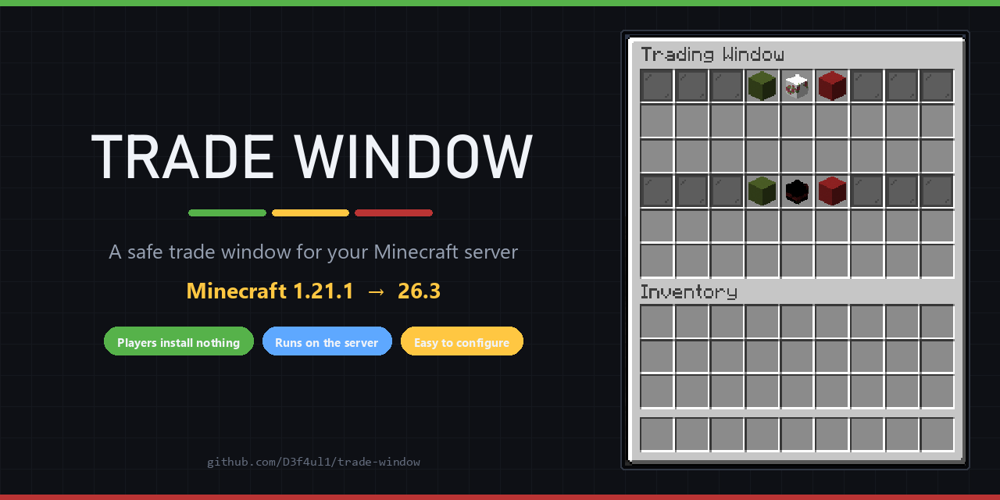
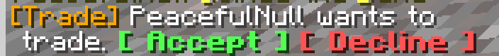
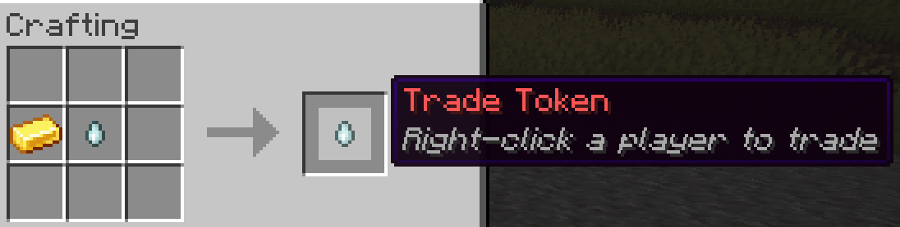
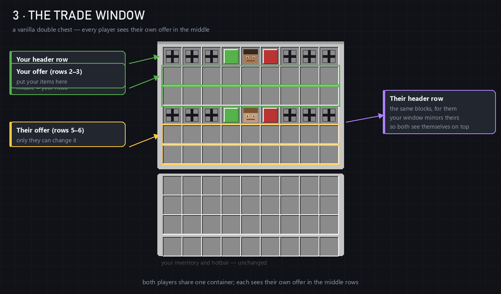
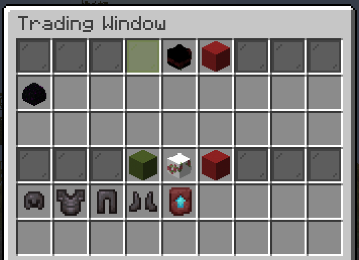

<div align="center">



# 🪟 Trade Window

**Two players, one window, and a swap that either happens completely or not at all.**
**Everything runs on the server — your players install nothing.**


</div>

## 🔒 Server-side only — players install nothing

Put the jar where the world runs — a dedicated server, or your own single-player world —
and that's the whole installation. People who join need **no mod, no resource pack, no
data pack**. Nothing at all.

It works because the trade window is a **plain chest**. The mod adds no item, no block, no
packet and no screen to the game; it only uses what vanilla Minecraft already has, so a
vanilla client cannot be kicked for not knowing something, and there is nothing for your
players to keep up to date. That is also why one design runs on every version from
**1.21.1 to 26.3**.

## 🕹️ How a trade goes

1. 🪙 Craft a **Trade Token** — a red Ghast Tear.
2. 👤 Hold it and **right-click** another player, or type `/trade <name>`.
3. 💬 They click **[ Accept ]** in chat and the window opens.

<div align="center">



*One line, two buttons. Nothing has been spent yet.*

</div>

4. 📦 Both players drop items into **their own rows** and click the 🟩 **green block**.
5. ✅ Both sides locked → the items swap and the window closes.

Until a side is locked, that player can keep changing their offer — and neither player can
ever touch the other player's items.

## 🪙 The Trade Token

<div align="center">



*Ghast Tear + Gold Ingot, anywhere in a crafting grid. It is the only thing you ever craft.*

</div>

The token is spent when the window opens, not when the request is sent — a request that is
never accepted costs you nothing.

## 🪟 The window

<div align="center">




*The same trade, the same moment, on both players' screens.*

</div>

- **Your offer is the middle rows, theirs are the bottom rows** — always, for both players.
  Look at the two pictures: it is the same armour, moved to whichever rows belong to the
  player looking at it. Neither player has to translate anything, and nobody sees their own
  items in the other player's half.
- 🟩 **Green block = LOCK** your side. It turns into a green pane saying `LOCKED`, which
  both players can see.
- 🟥 **Red block = CANCEL.** Either player can cancel at any time.
- **Every click is checked on the server** — the other side's items simply do not move.

Closing the window cancels the trade, and so do a disconnect, a death, a timeout, or
walking too far away. Whatever happens, **every item goes back to its owner** — nothing is
dropped on the floor and nothing is lost.

## 💬 Commands

**Players**

| Command | What it does |
|---|---|
| `/trade <player>` | Sends a trade request. Needs a Trade Token in your inventory. |
| `/trade accept` | Accepts the request currently shown to you. |
| `/trade decline` | Declines it. |

**Operators** — permission level 2:

| Command | What it does |
|---|---|
| `/tradeadmin crossdistance <on\|off>` | Trade from any distance, or enforce the block limit. Saved to the config straight away. |
| `/tradeadmin list` | Every live trade: both players, elapsed time, who has locked. |
| `/tradeadmin spectate <player>` | Watch a live trade read-only. Nothing changes for the players, and the timer is not affected. |
| `/tradeadmin history [player]` | The last 20 finished trades, optionally for one player. |

There is no `/trade lock` and no `/trade cancel`: locking and cancelling are clicks on the
green and red blocks **inside the window**. Two things, two blocks, no commands to remember.

## ⚙️ Configure it

`config/tradewindow.json` is written on first start with every setting in it. Change what
you like and restart, or use `/tradeadmin crossdistance` for that one.

```json
{
  "tradeTimeoutSeconds": 15,
  "guiTimeoutSeconds": 120,
  "maxDistanceBlocks": 20,
  "crossDistanceTrading": true,
  "cancelOnDamage": true,
  "cancelOnMove": false,
  "requireToken": true,
  "logTrades": true,
  "useDatabase": false,
  "allowCreativeTrading": false,
  "allowCrossDimensionTrading": false,
  "blacklistedItems": ["minecraft:bedrock", "minecraft:command_block"],
  "maxTradeValue": -1
}
```

The ones people actually change:

- ⏱️ **Timeouts** — `tradeTimeoutSeconds` for an unanswered request, `guiTimeoutSeconds`
  for the open window.
- 📏 **Distance** — `crossDistanceTrading: true` means any distance. Turn it off and the
  `maxDistanceBlocks` limit applies, but only once `cancelOnMove` is `true` as well.
- 🪙 **Token** — `requireToken: false` lets people trade without a token.
- 📦 **Limits** — `blacklistedItems` can never enter a window, and `maxTradeValue` caps
  how much one trade may move.
- 🧾 **Records** — `logTrades` writes one line per finished trade, and `useDatabase: true`
  additionally keeps history in SQLite.

Every field is optional — a missing line keeps its default, so deleting a line (or the
whole file) is a safe way to reset. Nonsense values are clamped to something sensible, and
the file is written back on load, so what you see in it is always what the server is using.

## 📦 Install

1. Install **Fabric Loader 0.19.3 or newer** where the game runs.
2. Put **Fabric API** and the **jar for your Minecraft version** in that `mods/` folder.
3. Start it. Players connect with no mods at all.

**[Download the jars »](../../releases)** — one per game version: `1.21.1` → `1.21.11` need
**Java 21**, `26.1` → `26.3` need **Java 25**. Each jar names the exact Minecraft version it
is built for, so a mismatched one refuses to load instead of misbehaving.

<sub>Building from source: `./gradlew buildAll` (JDK 21, plus JDK 25 for the 26.x targets)
writes all 14 jars to `versions/*/build/libs/`.</sub>

## 🚧 Coming later

A companion **client mod with a proper GUI** is in the works — drawn buttons, a live
countdown, drag-and-drop — for players who want to install it. This server-side build stays
behind it, so a server running it keeps serving vanilla clients either way.

## 📜 License

MIT — see [`LICENSE`](LICENSE). Use it, fork it, put it on your server.
